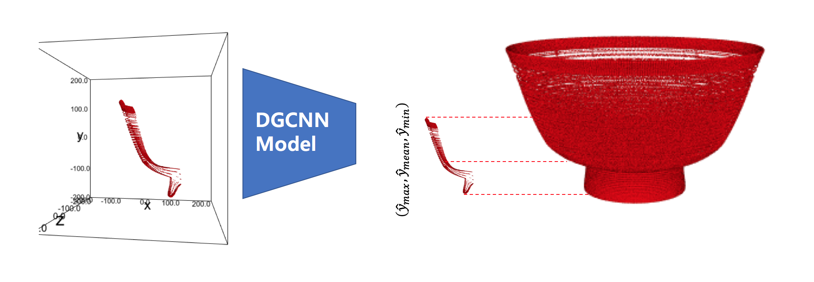

# IN PROGRESS

## AIRI_Pottery
3D classification and segmentation (location prediction) of points cloud data
* Each pottery(label) has various size of shards.  
* Each Shards has various size of points.  

---

## DATA PREPARING  
Data원본: AIRI-NAS(http://airi-nas.local:5000/)/Shared/Pottery/pottery_full_data 에 있습니다.  

실제 학습에 필요한 point cloud 데이터는 pottery_full_data의 하위폴더들에 있는 .npy 파일들이며 각 label별로 폴더에 따로 저장해서 사용하시면 됩니다.(make_filelist.ipynb 참고)  


1. run make_filelist.ipynb 
   * 도자기 별 shards list 생성(filelist_라벨_파편수_randomseed_F.txt)  
2. run edit_h5_seglabel.ipynb 
   * 도자기 별 shards' *CENTRALIZED* point cloud data, pottery labels(ID), segmentation_label 생성(라벨_파편수_randomseed.h5),
   * segmentation_label: 각 shard의 (y_max, y_mean, y_min) 을 label로 부여
   * train data, test data list 생성(train_files.txt, test_files.txt)
3. 위에서 생성한 h5 형식의 data와 train_files.txt, test_files.txt 를 한 폴더로 이동(provider.py 와 train_pottery_combined.py 에서 경로 참조)  

---

## Model


  
- train: ./train_pottery_combined.py  
- model: ./models/dgcnn+skipdense.py   

```bash
python train_pottery_combined.py
```

---

## RESULT FIGURE (ex)
#### 1. classification  


#### 2. location prediction  


---

## EXPERIMENT
- 실험 환경: ubuntu 16.04, 64Gmemory, 16core, GPU Tesla V100-SXM2(16G) * 2 (used 1 GPU)  
- Tensorflow
 
---

## VISUALIZATION
./pottery_demo.ipynb
- required: tetgen library
```bash
$ conda insatll -c conda-forge tetgen
```


---

## Acknowledgement
This code is heavily borrowed from [dgcnn](https://github.com/WangYueFt/dgcnn), and [pointnet](https://github.com/charlesq34/pointnet)

